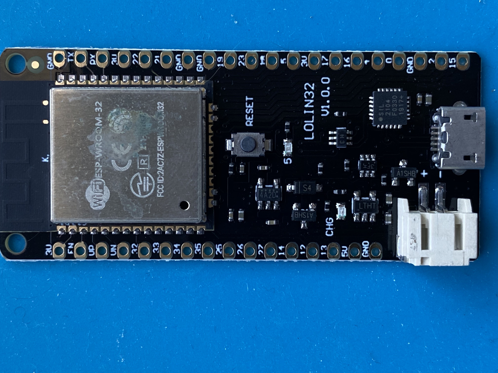
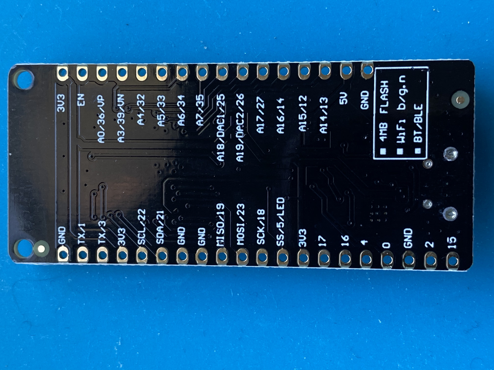

# Discoball Hardware Guide v2

## Parts List

| Part | Use | Qty|notes|
|----|----|---|----|
|ESP32 Lolin32 breakout board| CPU/wifi | 1|
|Sparkfun level shifter breakout board|voltage converter|1|
|4 pin screw terminal|LED connection|1|
|SPST or SPDT switch|power selection|1|3mm/breadboard compatible|
|100µF electrolytic capacitor|bypass capacitor|1|
|BME280/BME680|optional air sensor|1|_optional_|
|47K ohm resistors|I2C pullups|2|_optional_|
|100nF capacitor|bypass capacitor|1|_optional_|

Many of the parts are optional. The only mandatory parts are:

### LOLIN32 ESP32 breakout board

The LOLIN32 has a LIPO battery charger on it and has 16 pins on one side and 20 on the other. *Beware that some devices that are labelled "LOLIN32" have a different pinout and won't work on the Discoball board.*

 
 

Some board listings on Amazon and AliExpress use the label "LOLIN32" but have a different pinout, so please be careful. Also beware that the "LOLIN D32" is not the same as the "LOLIN32".

I've also purchased these LOLIN32 boards from AliExpress and had them work well.

### Level shifter

You'll want SparkFun's level shifter board or another that's pin-compatible. The high voltage (HV) side of the breakout board wants to be by the edge of the PCB; the low voltage (LV) wants to be the side nearest the ESP32.

[SparkFun Logic Level Converter - Bi-directional](https://www.sparkfun.com/products/12009)

 

### 4 pin screw terminal

You can skip this if you really want to, but you'll need a way to attach your LED wires to the board. If you solder them directly be sure to provide some kind of strain relief (like hot glue or something else so that the wires don't break or pull out of the board).

### SPST or SPDT switch

The switch lets you choose to power the board from the LEDs' 5V feed or the 5V  feed from the ESP32's USB port. The board has three holes so that you can use a SPST or SPDT switch. Only a SPST is required.

I used these switches from Amazon: 

https://www.amazon.com/gp/product/B007QAJUUS

If you'd like to mount a switch on a case you could use any SPST or SPDT switch, solder a header on the PCB and wire the switch to the header.

## Optional Parts

If you want to use a BME280 or BME680 breakout board or an external I2C device you'll need to solder on the 47K ohm resistors and the 100nF capacitor. The board has an error with positions for two 100nF capacitors - you only need one and can solder it in either position.
