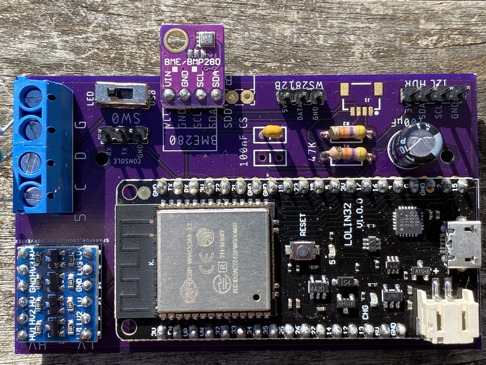
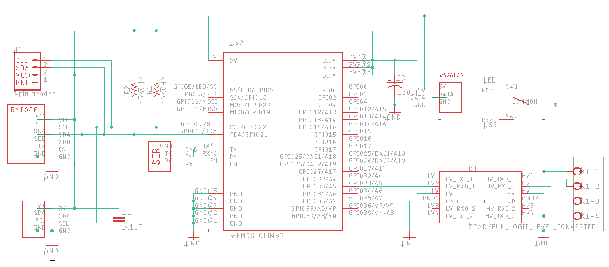

# discoball ESP32 FastLED Board

* Use this hardware at your own risk. I am not responsible if it does not work for you, if you waste money on it, if it catches fire and burns down your home, if your hair falls out or if it causes an election to go sour. I promise no support; you are on your own. *

 

Discoball is a simple printed circuit board intended to run [vendo](https://github.com/romkey/vendo) FastLED-based software with a variety of types of RGB LEDs with built-in controllers, like the WS2812B or APA102. These LEDs usually need to be driven at 5V, so the board includes hardware to

Discoball is Open Source Hardware. This repo includes [schematic](eagle/discoball-v2.sch) and [board](eagle/discoball-v2.brd) files for Autodesk Eagle.

You can [order Disocball boards from OSHPark](https://oshpark.com/shared_projects/Rrn2Y8C1).

